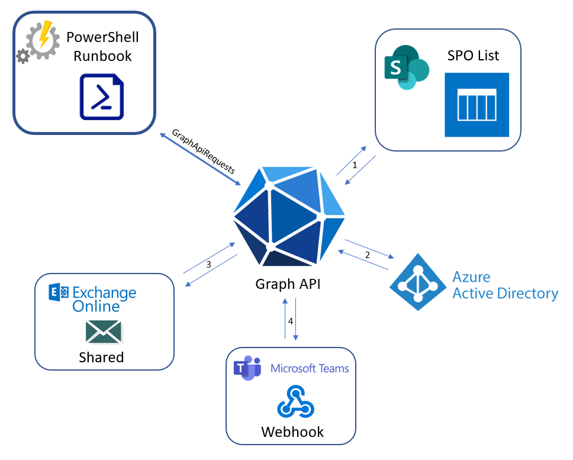

# Expiration Watcher
Azure objects expiration monitoring tool  
## Synopsis
Expiration Watcher is an Azure object expiration monitoring tool that proactively notifies users about upcoming expirations for certificates and secrets in Azure AD applications and other entities. The tool can monitor and notify expirations for the following object types:

- Azure Applications’ Client Secrets
- Azure Applications' Certificates
- iOS LoB apps
- APN certificate in Endpoint Manager
- Enterprise App SAML Sign Certificate

It is designed to run on Azure Automation Runbooks.

Please see the diagram below:  

## Dependencies
- Azure Automation Account
- Azure Registered Application
- Storage Account Table
- Shared Mailbox
- Teams Channel and configured webhook
- Powershell modules:
    - GraphApiRequests
    - GraphEmailSender
    - PSTeams
    - PSMarkdown